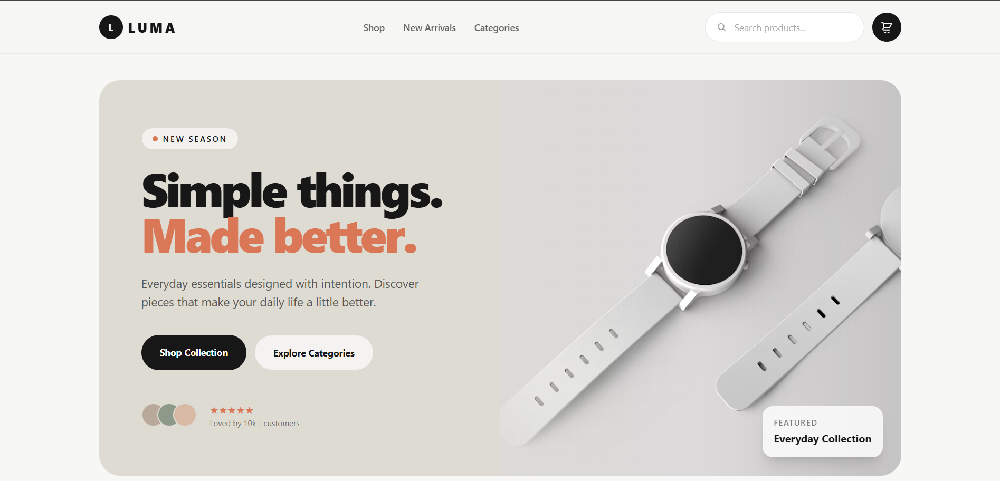
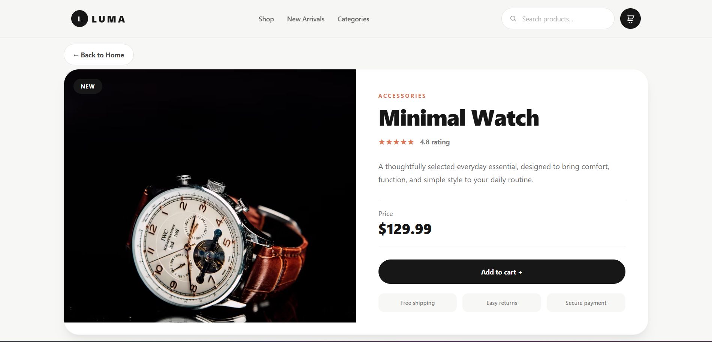
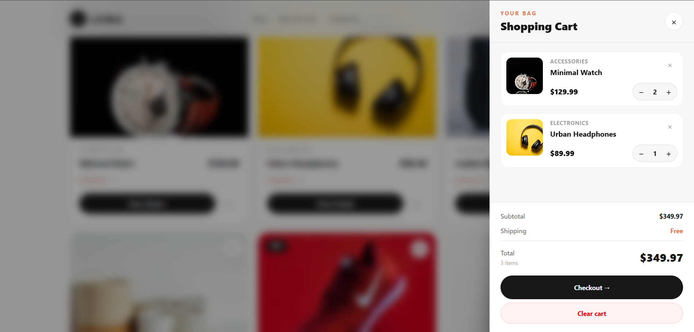

# LUMA — React E-commerce Store

LUMA is a responsive e-commerce front-end project built with React.  
Users can browse products, search and filter them, view product details, manage a shopping cart, and simulate a checkout process.

## Screenshots







## Features

- Browse a collection of products
- Filter products by category
- Search products by name
- View individual product details with React Router
- Add products to the shopping cart
- Increase or decrease product quantity
- Remove a single product from the cart
- Clear the entire shopping cart
- Automatically calculate subtotal, shipping, and total price
- Free shipping for orders over $50
- Persistent shopping cart using LocalStorage
- Checkout success message
- Custom 404 page for unknown routes
- Responsive user interface for different screen sizes

## Technologies Used

- React
- React Router DOM
- React Context API
- JavaScript (ES6+)
- Tailwind CSS
- LocalStorage
- Vite

## Project Structure

```text
src/
├── components/
│   ├── Navbar.jsx
│   ├── Hero.jsx
│   ├── CategoryFilter.jsx
│   ├── ProductGrid.jsx
│   ├── ProductCard.jsx
│   ├── Cart.jsx
│   └── Footer.jsx
│
├── context/
│   ├── CartContext.jsx
│   └── CartProvider.jsx
│
├── pages/
│   ├── Home.jsx
│   ├── ProductDetails.jsx
│   └── NotFound.jsx
│
├── App.jsx
├── main.jsx
└── index.css

public/
├── images/
│   ├── minimalWatch.avif
│   ├── urbanHeadphones.avif
│   ├── leatherBackpack.avif
│   ├── ceramicEssentials.avif
│   ├── classicSneakers.avif
│   └── dailySkincareSet.avif
└── screenshots/
    ├── home.png
    ├── product-details.png
    └── cart.png
```

## Cart Functionality

The cart state is managed with the React Context API.

Users can:

- Add a product to the cart
- Increase the quantity of an existing product
- Decrease product quantity
- Remove products from the cart
- Clear the complete cart
- Keep their cart after refreshing the browser

## LocalStorage

Cart data is stored in the browser using LocalStorage with this key:

```js
"luma-shopping-cart";
```

## Local Installation

### 1. Clone the repository

```bash
git clone https://github.com/ftm2903/luma-ecommerce.git
```

### 2. Open the project folder

```bash
cd luma-ecommerce
```

### 3. Install dependencies

```bash
npm install
```

### 4. Start the development server

```bash
npm run dev
```

Then open the local URL shown in your terminal, usually: `http://localhost:5173`

## Future Improvements

- Product sorting by price or rating
- Favorite products / wishlist
- Dark mode
- Real checkout form
- User authentication
- Backend API and database integration

## Author

**Fatemeh Jafaei**  
Frontend Developer in training  
Focused on JavaScript, React, and modern web development.

## License

This project was created for learning and portfolio purposes.
